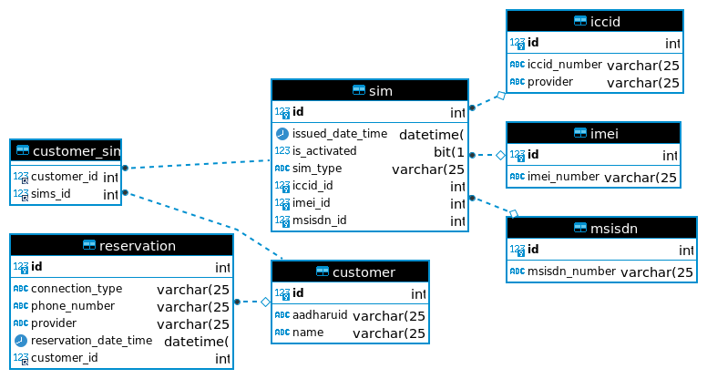

# **CAPSTONE PROJECT**

## **Wireless Inventory Number Management**

https://github.com/Anush0327/Inventory-Number-Management

(Software Requirements Specification)

**Table of Contents**

|Sr-no|context|
| :- | :- |
|1|Introduction|
||
1\.1. Purpose

1\.2. Scope
|
|2|System Description|
||
2\.1. System Overview

2\.2. System Architecture

2\.3. ER Diagram

2\.4. Technology Stack
|
|3|Functional Requirements|
||
3\.1. Use Case 1

3\.2. Use Case 2
|
|4|Non-Functional Requirements|
||
4\.1. Performance Requirements

4\.2. User Interface Requirements

4\.3. Database Requirements

4\.4. Compatibility Requirements
|
|5|User Interface Design|
||
5\.1. Wireframes

5\.2. Mockups
|
|6|Data Model|
||
6\.1. Entity-Relationship Diagram

6\.2. Database Schema

|
|7|API Specification|
||
7\.1. API Endpoints

7\.2. Data Formats

7\.3. Authentication and Authorization
|
|8|Testing|
||
8\.1. Unit Testing

8\.2. Integration Testing

8\.3. User Acceptance Testing
|
|9|Deployment|
||
9\.1. Deployment Architecture

9\.2. Deployment Instruction
|

### **1. Introduction**

**1.1 Purpose**

The purpose of this document is to outline the requirements for the development of the Wireless Inventory Number Management system. It focuses on defining both the functional and non-functional aspects necessary for successful system implementation.

**1.2 Scope**

The system is designed to manage ICCID, MSISDN, and IMEI numbers in wireless networks. This encompasses the tracking, reservation, and allocation of these numbers, with the primary aim of benefiting wireless service providers by streamlining their inventory management processes.

**1.3 Definitions**

For clarity, here are some key definitions:

- ICCID (Integrated Circuit Card Identifier): A unique identifier associated with SIM cards, vital for their identification and functionality.
  *example*:- 8991000904443084459U (MMCC-IINN-NNNN-NNNN-NN-C(X) format where,
  -  MM = Constant (ISO 7812 Major Industry Identifier)
  -  CC = Country Code
  -  II = Issuer Identifier
  - N{12} = Account ID ("SIM number")
  - C = Checksum calculated from the other 19 digits using the Luhn algorithm.
  - x = An extra 20th digit is returned by the 'AT!ICCID?' command, but it is not officially part of the ICCID.)
- MSISDN (Mobile Station International Subscriber Directory Number): A mobile phone number within the global cellular network, used to route calls and messages.
- IMEI (International Mobile Equipment Identity): A globally unique identifier assigned to mobile devices, crucial for device identification and tracking.

### **2. System Description**

**2.1 System Overview**

The system consists of two primary components: a backend developed using Java Spring Boot and a frontend built with React.js. Together, they provide the capability for users to efficiently reserve and manage wireless numbers.

**2.2 System Architecture**

The system follows a client-server architecture with a RESTful API, facilitating seamless communication between the frontend and backend components

.

**2.3 ER Diagram**

The system's data flow begins with user input through the frontend. This data is then processed in the backend, where it undergoes various operations. Subsequently, the processed results are relayed back to the frontend for display.

**2.4 Technology Stack**

- The system's technology stack comprises the following key components:
- Backend: Java 11, Spring Boot 2.7.13
- Frontend: React.js
- Database: MySQL (MySQLdatabase technology)

### **3. Functional Requirements**

**3.1 Use Cases**

The system encompasses several essential functionalities, including:

- Reservation of Numbers: Users can reserve ICCID, MSISDN, and IMEI numbers, ensuring their availability for future use.
- Allocation to Customers: When numbers are allocated to customers, the system will associate ICCID with the corresponding MSISDN and IMEI.
- Tracking and Availability: The system diligently tracks reservation dates and monitors the availability of numbers, aiding users in making informed decisions regarding number allocation.

### **4. Non-Functional Requirements**

**4.1 Performance**

The system's performance expectations include:

Responsiveness: The system should exhibit responsiveness, ensuring that actions such as number reservation are carried out with minimal latency.

**4.2 User Interface**

The user interface design will adhere to the following criteria:

- User-Friendly Design: The user interface will be intuitively designed for ease of use.
- Responsiveness: The interface will be responsive to various screen sizes and devices, ensuring a consistent user experience.

**4.3 Database**

The system's database requirements encompass the following:

Database Technology: The choice of database technology (e.g., MySQL) will be made with data security and efficiency in mind.

**4.4 Compatibility**

The system will ensure compatibility as follows:

Cross-Browser Compatibility: The frontend will be designed to function seamlessly across different web browsers, providing a consistent experience to all users.

### **5. User Interface Design**

- The user interface will prioritize simplicity and user-friendliness. It will include:
- Simple Forms: The UI will incorporate straightforward forms for number reservation.
- Intuitive Layout: The layout will be designed with user intuitiveness in mind, enhancing the tracking of reservations.

### **6. Data Model**

The data model will consist of key entities for ICCID, MSISDN, and IMEI, securely stored within the chosen database system.
and also User,Customer and other required entities to support the functionality.

### **7. API Specification**

The system will define RESTful API endpoints with specifications covering:

- Reserving Numbers: API endpoints will be provided for reserving ICCID, MSISDN, and IMEI numbers.
- Reverting Changes: API endpoints will be provided for changing the ICCID number based on the registered network,IMEI numbers must be changed based on the user's handset and MSISDN should be changed based on new SIM purchase.
- Association: APIs will enable the association of ICCID with corresponding MSISDN and IMEI.
- Availability Checks: Endpoints for checking the availability of numbers will also be included.

### **8. Testing**

A comprehensive testing strategy will be employed, encompassing the following:

- Unit Testing: Testing of individual components, ensuring their functionality in isolation.
- Integration Testing: Verification of interactions between different system components.
- User Acceptance Testing: Evaluation of the system's compliance with user requirements and expectations.

### **9. Deployment**

Deployment of the system will involve the following:

- Deployment Architecture: The architecture for deploying the backend and frontend in a production environment will be determined.
- Deployment Instructions: Detailed instructions will be provided to guide the deployment process, ensuring successful implementation.

### Q &A Part : 

**Project Objective:**

1. What is the main goal of the web project?
2. What problem or need does it address?
3. What are the expected outcomes or deliverables?

**Target Audience:**
Do we have user personas or profiles to consider?

**Functionality and Features:**

1. What specific features and functionality should the website have?
2. Are there any interactive elements(both external or on server) or special requirements?

**Content and Information:**

1. What content and information should be included on the website?
2. Is content provided, or should it be created?

**Design and User Experience:**

1. Are there any design preferences or brand guidelines to follow?
2. How should the user experience be optimized for the target audience?

**Hosting and Domain:**

1. Have hosting and domain considerations been made?
2. Should the website be hosted on a specific platform?

**Security and Privacy:**

1. What security measures need to be in place to protect user data?
2. Are there privacy regulations to comply with?

